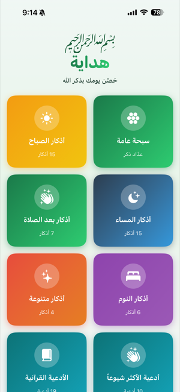
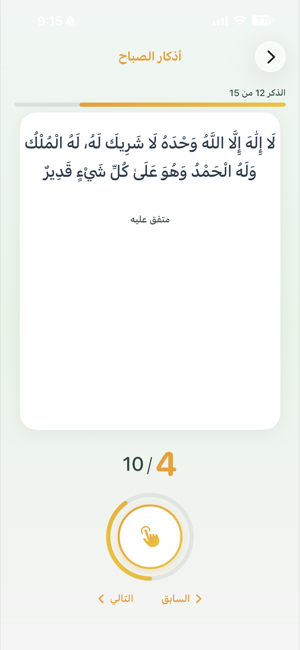
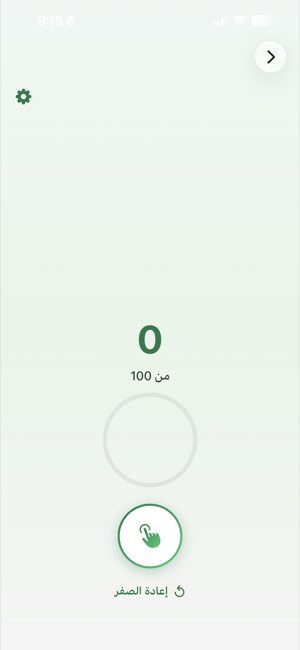

# 🕌 Hedaya (هداية) - iOS Azkar App

A beautiful iOS application for reciting Azkar (Islamic remembrances) and Ad3ia (supplications) with an interactive counter. **حَصِّن يومك بذكر الله** — Fortify your day with the remembrance of Allah.

**License:** This project is under a custom license. See [LICENSE](LICENSE). You may contribute to this repo but may not fork or reuse the code, design, or ideas elsewhere.

## Features

- 📱 **7 content groups**: Morning & Evening Azkar, After Prayer, Sleep, Miscellaneous, plus **أدعية الأكثر شيوعاً** (Most Popular Supplications) and **الأدعية القرآنية** (Qur’anic Supplications)
- 📿 **General Sebha (سبحة عامة)**: Standalone counter with custom target (e.g. 100) and reset
- 🔢 **Interactive counter**: Tap the circle to count each Zikr; progress bar and ring show completion
- ✨ **Auto-advance**: When the recommended count is reached, the app moves to the next Zikr
- 📖 **References**: Each Zikr/Dua shows its source (e.g. متفق عليه، رواه البخاري، سورة البقرة)
- 🎨 **Beautiful UI**: Gradient cards per category, teal theme for Ad3ia, smooth animations
- 🌙 **RTL support**: Full right-to-left layout for Arabic

## App Screens

*Screenshots: add `home.png`, `azkar-group.png`, and `general-sebha.png` to [`docs/screenshots/`](docs/screenshots/) for the images below to render.*

### Home (Main Screen)



- **بسم الله الرحمن الرحيم** and app name **هداية** with tagline *حصن يومك بذكر الله*
- Grid of cards:
  - **سبحة عامة** (General Tasbeeh) — عدّاد ذكر (Zikr counter)
  - **أذكار الصباح** (Morning Azkar) — 15 أذكار
  - **أذكار المساء** (Evening Azkar) — 15 أذكار
  - **أذكار بعد الصلاة** (After Prayer) — 7 أذكار
  - **أذكار النوم** (Sleep) — 6 أذكار
  - **أذكار متنوعة** (Miscellaneous) — 4 أذكار
  - **أدعية الأكثر شيوعاً** (Most Popular Supplications) — 10 أدعية
  - **الأدعية القرآنية** (Qur’anic Supplications) — 19 أدعية
- Each card shows an icon, title, and count; tapping opens that group or the general counter.

### Azkar / Ad3ia Group Screen



- Header with group name (e.g. أذكار الصباح) and back button
- **Progress**: “الذكر X من Y” and a horizontal progress bar
- **White card** with the current Zikr/Dua in large Arabic (with diacritics) and the reference below
- **Counter**: “current / target” (e.g. 4 / 10) and a circular tap button with progress ring
- **Previous / Next** (السابق / التالي) to move between items
- When the group is completed, a completion screen with **بارك الله فيك** and options to restart or go home

### General Sebha (Counter) Screen



- Large count (e.g. 0) and “من 100” (out of 100) for the target
- Hollow progress circle that fills as you count
- Green **tap button** to increment
- **إعادة الصفر** (Reset to zero) to clear the count

## Quick Start

### Option 1: Using Xcode (Recommended)

1. Open `Hedaya.xcodeproj` in Xcode
2. Select an iOS Simulator (e.g., iPhone 16)
3. Press `⌘R` to build and run

### Option 2: Using Scripts

#### Quick Start Script (Just opens simulator)
```bash
./quick-start.sh
```

#### Build and Run the App

**Option 1: Using Xcode (Recommended - Most Reliable)**
```bash
open Hedaya.xcodeproj
# Then press ⌘R in Xcode
```

**Option 2: Command Line Scripts**
```bash
# Method 1: Use Xcode's build system (recommended if Xcode works)
./build-from-xcode.sh

# Method 2: Direct build script
./build-and-run.sh

# Or specify a device
./build-and-run.sh "iPhone 15"
```

#### Full Script (Start simulator + build + run)
```bash
# Start simulator only
./start-simulator.sh start

# Start specific device
./start-simulator.sh start "iPhone 15"

# List all available simulators
./start-simulator.sh list

# Build and run the app (uses build-and-run.sh)
./start-simulator.sh run
```

## Project Structure

```
Hedaya/
├── HedayaApp.swift          # App entry point
├── Models.swift             # Data models (Zikr, AzkarGroup with tags)
├── AzkarData.swift          # Loads groups from JSON (cached)
├── DataLoader.swift         # Loads Data/groups.json & Data/azkar/*.json
├── Data/                    # All content (data separate from logic)
│   ├── groups.json          # Group metadata (id, name, icon, color, tags, order)
│   ├── README.md            # How to add groups and tags
│   └── azkar/               # One JSON file per group (e.g. morning.json, ad3ia_quran.json)
├── ContentView.swift        # Main screen with group cards
├── AzkarGroupView.swift     # Zikr/dua counter screen (progress, tap to count)
├── GeneralSebhaView.swift   # General sebha (standalone counter with reset)
├── ZikrCounterView.swift    # Reusable counter components
└── Assets.xcassets/         # App assets
```

## Requirements

- **Xcode 15.0 or later** (full app, not just Command Line Tools)
- iOS 17.0 or later
- macOS 13.0 or later

## Setup

### First Time Setup

If you encounter errors like "unable to find utility 'simctl'" or "Unable to find application named 'Simulator'", you need to install and set up Xcode:

#### Step 1: Install Xcode

Run the installation helper:
```bash
./install-xcode.sh
```

This script will:
- Check if Xcode is already installed
- Open the App Store to install Xcode
- Provide installation guidance

**Note:** Xcode is large (~15GB download) and installation can take 30-60 minutes.

#### Step 2: Configure Xcode

After Xcode is installed, run the setup script:
```bash
./setup-xcode.sh
```

This script will:
- Check if Xcode is installed
- Configure Xcode as the active developer directory
- Verify the iOS Simulator tools are available

#### Step 3: Fix Simulator Issues (if needed)

If you see "iOS Simulator tools are not available", run:
```bash
./fix-simulator.sh
```

This script will:
- Diagnose Simulator issues
- Fix common problems
- Start the Simulator service
- Guide you through component installation

#### Step 4: Verify Setup

Test the simulator:
```bash
./quick-start.sh
```

If you see "✓ Simulator started!", you're all set!

#### Manual Setup (Alternative)

If the scripts don't work, you can set up manually:

1. **Install Xcode** from the App Store
2. **Configure Xcode**:
   ```bash
   sudo xcode-select --switch /Applications/Xcode.app/Contents/Developer
   ```
3. **Open Xcode once** to accept the license agreement

### Verify Setup

After setup, test the simulator:
```bash
./quick-start.sh
```

If you see "✓ Simulator started!", you're all set!

## How to Use

**From the home screen:**

1. **General counter**: Tap **سبحة عامة** to use the standalone counter; set your target (e.g. 100), tap to count, and use **إعادة الصفر** to reset.
2. **Azkar or Ad3ia group**: Tap any other card (e.g. أذكار الصباح or الأدعية القرآنية).
3. **Read**: The current Zikr or Dua is shown in Arabic with its reference (e.g. متفق عليه، سورة البقرة).
4. **Count**: Tap the circular button to increment; the ring and “X / Y” show progress.
5. **Auto-advance**: When you reach the recommended count, the app moves to the next item.
6. **Navigate**: Use **السابق** / **التالي** (Previous/Next) to move manually.
7. **Finish**: When the group is complete, a completion screen appears with **بارك الله فيك**; you can restart or return home.

## Content Groups

| Group | Arabic | Count | Notes |
|-------|--------|-------|------|
| Morning Azkar | أذكار الصباح | 15 أذكار | ☀️ |
| Evening Azkar | أذكار المساء | 15 أذكار | 🌙 |
| After Prayer | أذكار بعد الصلاة | 7 أذكار | 🤲 |
| Sleep | أذكار النوم | 6 أذكار | 🛏️ |
| Miscellaneous | أذكار متنوعة | 4 أذكار | ✨ |
| Most Popular Supplications | أدعية الأكثر شيوعاً | 10 أدعية | Prophetic duas ﷺ |
| Qur’anic Supplications | الأدعية القرآنية | 19 أدعية | From Quran (سورة/آية) |

Content is stored in **`Hedaya/Data/`** as JSON; see **`Hedaya/Data/README.md`** to add or edit groups and tags (e.g. Ad3ia, From Quran, MostPopular).

## Deploy to Your Device

To install and run Hedaya on your iPhone or iPad:

### Quick Start

1. **Connect your device** via USB and unlock it
2. **Open the project**: `open Hedaya.xcodeproj`
3. **Select your device** from the device menu (top toolbar)
4. **Configure signing** (one-time):
   - Click on the project (blue icon) → Select "Hedaya" target
   - Go to "Signing & Capabilities" tab
   - Check "Automatically manage signing"
   - Select your Team (Apple ID)
5. **Press ⌘R** to build and install
6. **Trust the developer** on your device (first time only):
   - Settings → General → VPN & Device Management
   - Tap your Apple ID → Trust

### Complete Guide

📖 **See `DEPLOY_TO_DEVICE.md` for detailed step-by-step instructions** including:
- Complete deployment process
- Troubleshooting common issues
- Free vs paid developer accounts
- Tips and best practices

**Having provisioning issues?** See `FIX_PROVISIONING.md` for help with device registration errors.

### Command Line Method

```bash
./build-for-device.sh
```

**Note**: You still need to configure signing in Xcode first (see Quick Start above).

## App Icon

To generate the app icon:

```bash
# Install Pillow (if not already installed)
pip3 install Pillow

# Generate icons
python3 generate-icon.py
```

Or see `ICON_GUIDE.md` for detailed instructions and alternative methods.

The icon features a green gradient background with a crescent moon and star, matching the Islamic theme of the app.

## License

Copyright (c) 2025 Ahmed Atya. All rights reserved.

This project is under a **custom license**. See [LICENSE](LICENSE) for the full terms. In short:

- **You may**: use the app and source for personal or educational reference, and contribute (e.g. pull requests) to this repository.
- **You may not**: fork or reuse the code, design, or ideas in other projects; redistribute or create derivative works; or use the Hedaya name/branding elsewhere.

For uses beyond this license, contact the copyright holder.

---

**بارك الله فيك** — May Allah bless you
